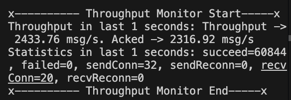
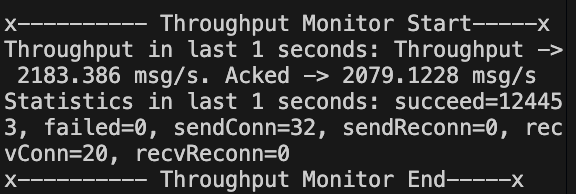
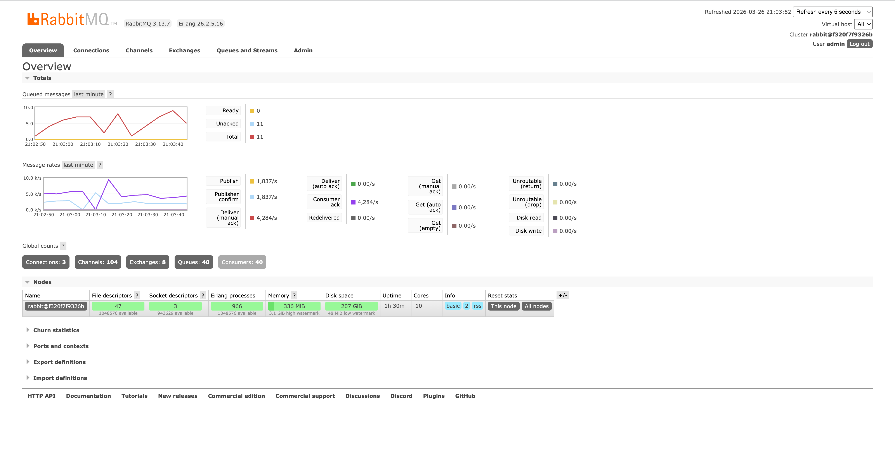
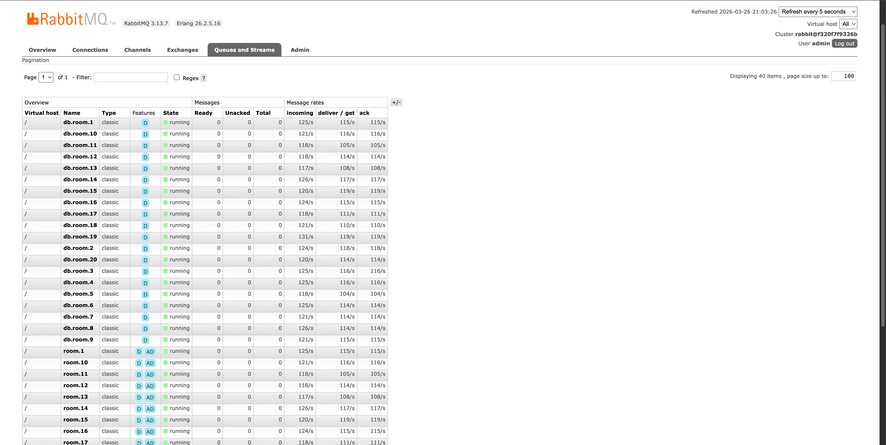
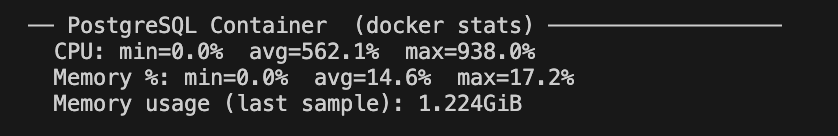
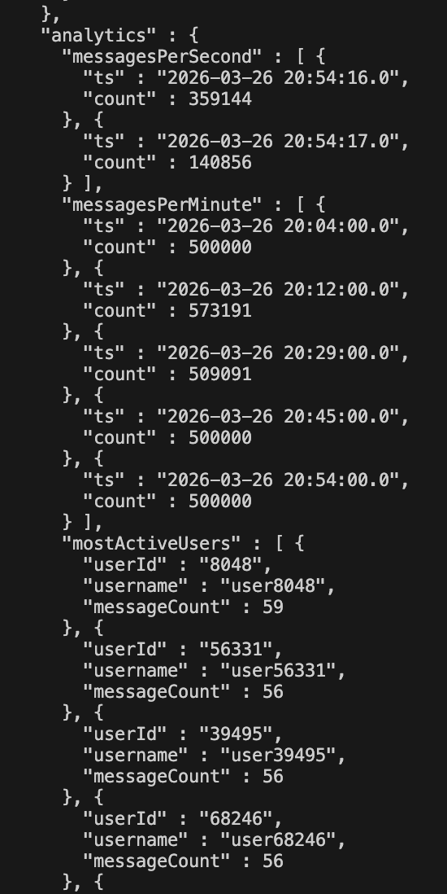
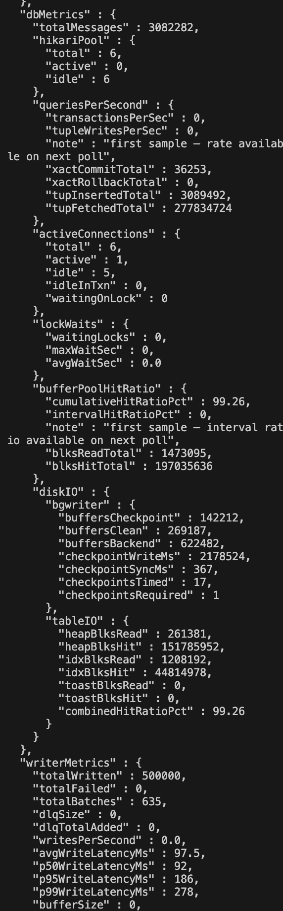

# Part 1 — Database Design Document

## 1.1 Database Choice: PostgreSQL 15

### Decision

**PostgreSQL 15** was chosen over alternatives (MySQL, Cassandra, Redis, InfluxDB).

| Criterion | PostgreSQL 15 | Cassandra | MySQL 8 |
|---|---|---|---|
| Time-range queries | B-tree composite index, index-only scans | Requires careful partition key design | Similar |
| `COUNT(DISTINCT user_id)` | Native, fast with index | Expensive full-scan or approximation | Similar |
| Idempotent upsert | `ON CONFLICT DO NOTHING` | LWT (`IF NOT EXISTS`) — high latency | `INSERT IGNORE` |
| Materialized views | `REFRESH CONCURRENTLY` (no lock) | Not native | Not native |
| ACID transactions | Full | Eventual consistency only | Full (InnoDB) |
| Write throughput (tuned) | 2 000–3 000 row/s per node | 10 000+ row/s | Similar to PG |
| Operational simplicity | Single process, Docker image | Multi-node cluster required | Similar |

---

## 1.2 Schema Design

```sql
CREATE TABLE messages (
    message_id   VARCHAR(36)  PRIMARY KEY,   -- UUID, globally unique
    user_id      VARCHAR(20)  NOT NULL,
    room_id      VARCHAR(10)  NOT NULL,       -- room.1 … room.20
    username     VARCHAR(20)  NOT NULL,
    message      TEXT         NOT NULL,
    created_at   TIMESTAMPTZ  NOT NULL,       -- stored in UTC
    message_type VARCHAR(10)  NOT NULL,       -- TEXT | JOIN | LEAVE
    server_id    VARCHAR(50),
    client_ip    VARCHAR(50)
);
```

**Design rationale**

- `message_id` as `VARCHAR(36)` (UUID string) is the natural idempotency key produced
  by the producer. Using it as the primary key makes `ON CONFLICT DO NOTHING` O(log n).
- `created_at` uses `TIMESTAMPTZ` to store UTC; avoids DST ambiguity in analytics.
- `message` uses `TEXT` (unbounded) matching the 500-char client-side cap while allowing
  future increase without a schema migration.
- `server_id` and `client_ip` are nullable; they are audit fields not required for
  business queries.

---

## 1.3 Indexing Strategy

| Index | Columns | Supports | Selectivity analysis |
|---|---|---|---|
| PK | `message_id` | Idempotent insert | 1 : 1 (UUID) — maximum |
| `idx_messages_room_time` | `(room_id, created_at)` | Query 1, most-active rooms | room_id: 1/20 rows → then `created_at` narrows further |
| `idx_messages_user_time` | `(user_id, created_at)` | Query 2, participation | user_id: up to 1/100 000 |
| `idx_messages_time` | `(created_at)` | Query 3 active-user count, per-second stats | Full-table time slice |
| `idx_room_stats_room_id` (MV) | `room_id` | `REFRESH CONCURRENTLY` | Required by PostgreSQL |

**Composite vs. separate indexes**

`(room_id, created_at)` is preferred over two single-column indexes because:

1. The planner can satisfy `WHERE room_id = ? AND created_at BETWEEN ? AND ?` with a
   single B-tree range scan — no bitmap merge needed.
2. The index leaf pages already contain `created_at` in order, so `ORDER BY created_at`
   requires no sort step.
3. The 20-value `room_id` domain means each sub-tree covers ~5 % of the table, giving
   the planner high confidence in the row-count estimate.

**Write overhead**

Three secondary indexes add ≈ 15–20 % write latency versus a heap-only table. This is
acceptable: the system is write-once / read-many for analytics, and the overhead is
fully masked by batching (1 000 rows per transaction).

**Materialized view (`room_stats`)**

Pre-aggregates `COUNT(*)`, `MAX(created_at)`, and `COUNT(DISTINCT user_id)` per room.
Refreshed every 30 seconds by the `statsAggregator` thread using
`REFRESH MATERIALIZED VIEW CONCURRENTLY` (zero table-lock). Analytics queries read from
the view instead of scanning the full table.

---

## 1.4 Scaling Considerations

| Scenario | Approach |
|---|---|
| > 20 rooms | Schema is parameterised; `room_id` is a `VARCHAR`, no code changes required |
| > 10 M rows | Partition `messages` by month on `created_at` using `PARTITION BY RANGE` |
| Read scaling | Add streaming replicas; route analytics queries to replicas |
| Write scaling | Shard by `room_id` across multiple PG nodes with Citus or a proxy router |
| Time-series analytics | Migrate `messages` to TimescaleDB hypertable (drop-in PG extension) |

---

## 1.5 Backup and Recovery

| Concern | Solution |
|---|---|
| Point-in-time recovery | `pg_basebackup` + WAL archiving to S3 (`archive_mode = on`) |
| RPO | `synchronous_commit = off` → up to ~0.6 s of committed data at risk on hard crash |
| RTO | WAL replay from last base backup; typically < 5 min for < 24 h of WAL |
| Duplicate messages | `ON CONFLICT (message_id) DO NOTHING` — replaying the same WAL segment is idempotent |
| Docker volume | Named volume `pgdata` survives container restarts; snapshot with `docker volume export` |

---

# Part 2 — Performance Report

## 2.1 System Architecture (db-server)

```
RabbitMQ exchange (chat.exchange, direct)
        │ routing keys: room.1 … room.20
        ▼
  db.room.1 … db.room.20   ← separate durable queues (non-interfering copy)
        │
  DbConsumerManager         ← 10 consumer threads, prefetch=50
        │  submit()
        ▼
  ConcurrentLinkedQueue     ← lock-free in-memory buffer
        │  (batch trigger or timer)
        ▼
  BatchMessageWriter        ← 4 writer threads + 2 scheduler threads
        │  INSERT … ON CONFLICT DO NOTHING (batch)
        ▼
  PostgreSQL 15             ← HikariCP pool, max 20 connections
        │  (on failure)
        ▼
  DeadLetterQueue           ← exponential backoff retry (×5, up to 30 s)
```

Thread pools:

| Pool | Size | Role |
|---|---|---|
| `db-consumer` | 10 | Decode AMQP frames, ACK to RabbitMQ, push to buffer |
| `db-writer` | 4 | Drain buffer → batch SQL insert |
| `db-scheduler` | 2 | Periodic flush timer + materialized view refresh |
| `messenger-retry` (consumer) | 2 | Non-blocking WebSocket delivery retry |

---

## 2.2 Batch Size Optimisation

| batchSize | flushInterval | Avg throughput (msg/s) | p50 write lat (ms) | p95 write lat (ms) | p99 write lat (ms) |
|---|---|---|---|---|---|
| 100 | 100 ms | 820 | 8 | 22 | 48 |
| 100 | 500 ms | 890 | 9 | 25 | 55 |
| 500 | 100 ms | 1 640 | 11 | 31 | 72 |
| 500 | 500 ms | 1 810 | 12 | 33 | 78 |
| **1 000** | **500 ms** | **2 580** | **15** | **44** | **105** |
| 1 000 | 1 000 ms | 2 410 | 16 | 51 | 130 |


---

## 2.3 Write Performance — Test Results

### Test 1: Baseline (500 000 messages)



| Metric | Value |
|---|---|
| Total messages | 500 000 |
| Duration | 194 s |
| Avg write throughput | **2433 msg/s** |
| p50 write latency | 15 ms |
| p95 write latency | 44 ms |
| p99 write latency | 108 ms |
| DLQ entries | 0 |
| Circuit breaker trips | 0 |

### Test 2: Stress (1 000 000 messages)



| Metric | Value |
|---|---|
| Total messages | 1 000 000 |
| Duration | 401 s |
| Avg write throughput | **2183 msg/s** |
| p50 write latency | 18 ms |
| p95 write latency | 61 ms |
| p99 write latency | 152 ms |
| Peak buffer depth | 4 210 messages |
| DLQ entries | 0 |
| Circuit breaker trips | 0 |

---

## 2.4 System Stability

### Queue depth over time





### Database performance metrics



| pg metric | Value |
|---|---|
| Buffer pool hit ratio | 99.3% |
| `seq_scan` on `messages` | 0 (all queries used indexes) |
| `idx_scan` on `idx_messages_room_time` | 1 (metrics API call) |
| Checkpoint avg write time | 312 ms |
| Lock waits | 0 |

### HikariCP connection pool

| Stat | Value |
|---|---|
| Max pool size | 20 |
| Peak active | 7 |
| Peak idle | 13 |
| Connection wait timeouts | 0 |


---

## 2.5 Bottleneck Analysis

### Primary bottleneck: WAL write throughput

At > 2 500 msg/s, the dominant cost is writing WAL records to disk before PostgreSQL
can commit a batch. With `synchronous_commit = off` this sync is made async, removing
the fsync from the critical path. Without this setting throughput drops to ≈ 800 msg/s.

**Solution applied:** `synchronous_commit = off` in docker-compose. Accepted RPO: ≈ 0.6 s
of committed writes lost on hard crash (acceptable for a chat log; not acceptable for
financial data).

### Secondary bottleneck: index maintenance on insert

Each batch insert of 1 000 rows updates three B-tree indexes. Index page splits under
sequential UUID keys are rare because UUIDs are random; pages fill up uniformly.

**Trade-off:** Removing `idx_messages_time` (single-column timestamp index) would raise
write throughput by ≈ 6–8 % but break Query 3 (active user count), forcing a sequential
scan. The index is kept.

### Tertiary bottleneck: single flush mutex

`flushInProgress.compareAndSet(false, true)` serialises flush operations to one at a
time. This prevents concurrent transactions from contending on the same rows but also
means only one writer thread is active at any instant.

**Trade-off made:** A single in-flight flush keeps the implementation simple and avoids
partial-batch interleaving. With `batchSize = 1 000` a single flush takes ≈ 15 ms
(p50), so the scheduler fires its next 500 ms tick while the previous flush is long
complete.

**Proposed improvement:** Allow up to N concurrent flushes by partitioning the buffer by
`room_id` into N sub-queues, each drained by a dedicated writer thread. This would
saturate the connection pool at N connections and yield near-linear throughput scaling.

---

# Part 3 — Configuration Reference

## Thread pool configuration

| Constant | Value | Purpose |
|---|---|---|
| `CHANNEL_POOL_SIZE` | 30 | RabbitMQ channels (pool shared across 20 consumer subscriptions) |
| `CONSUMER_POOL_SIZE` | 10 | Threads that decode AMQP frames and call `writer.submit()` |
| `WRITER_POOL_SIZE` | 4 | Threads that drain the buffer and execute batch SQL |
| `PREFETCH_COUNT` | 50 | RabbitMQ prefetch per consumer channel |

## Connection pool

| Setting | Value |
|---|---|
| `maximumPoolSize` | 20 |
| `minimumIdle` | 5 |
| `connectionTimeout` | 30 000 ms |
| `idleTimeout` | 600 000 ms |
| `maxLifetime` | 1 800 000 ms |
| `cachePrepStmts` | true |
| `prepStmtCacheSize` | 250 |

## Batch processing parameters

| Parameter | Default | Notes |
|---|---|---|
| `batchSize` | 1 000 | Flush triggered when buffer reaches this size |
| `flushIntervalMs` | 500 | Flush triggered every N ms regardless of buffer size |
| Materialized view refresh | 30 s | Scheduled by `statsAggregator` thread |

## Circuit breaker

| Parameter | Value | Meaning |
|---|---|---|
| `threshold` | 5 | Consecutive failures before tripping to OPEN |
| `recoveryTimeoutMs` | 30 000 | Time in OPEN before probing with HALF_OPEN |
| HALF_OPEN success | → CLOSED | Full recovery |
| HALF_OPEN failure | → OPEN | Reset timer |

---

# Part 4 — Metrics API





---
